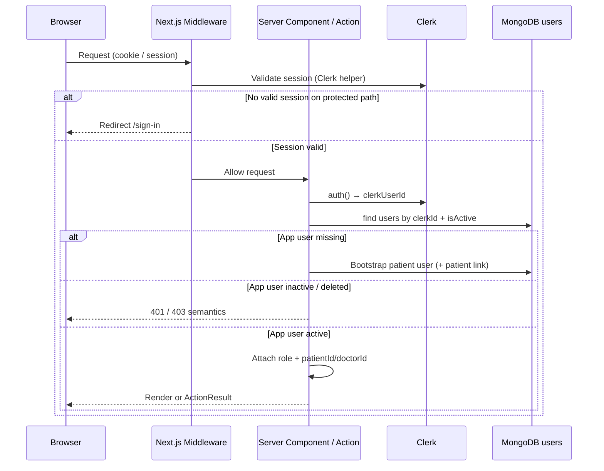
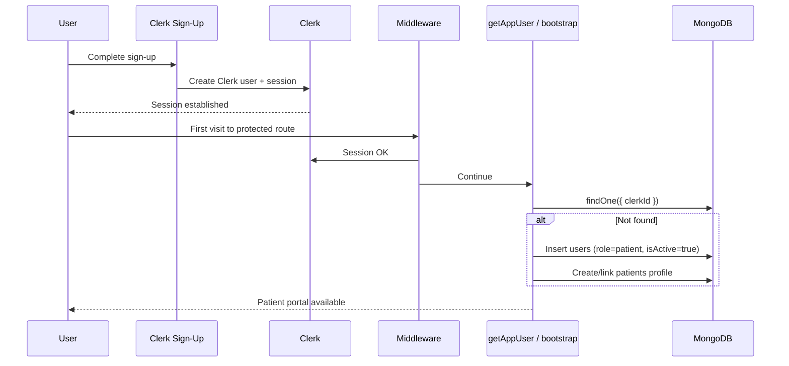
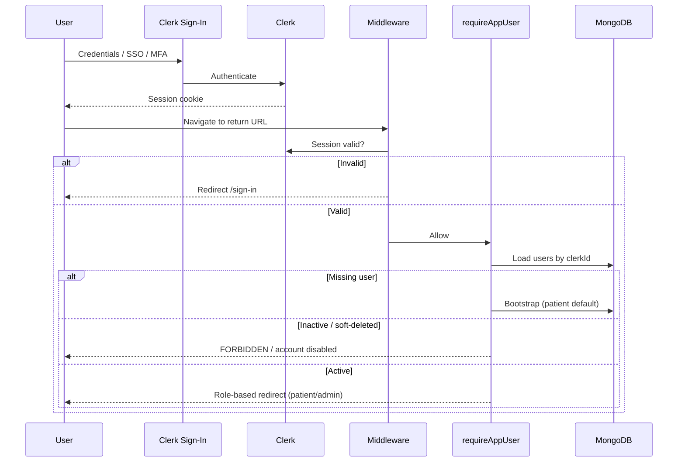
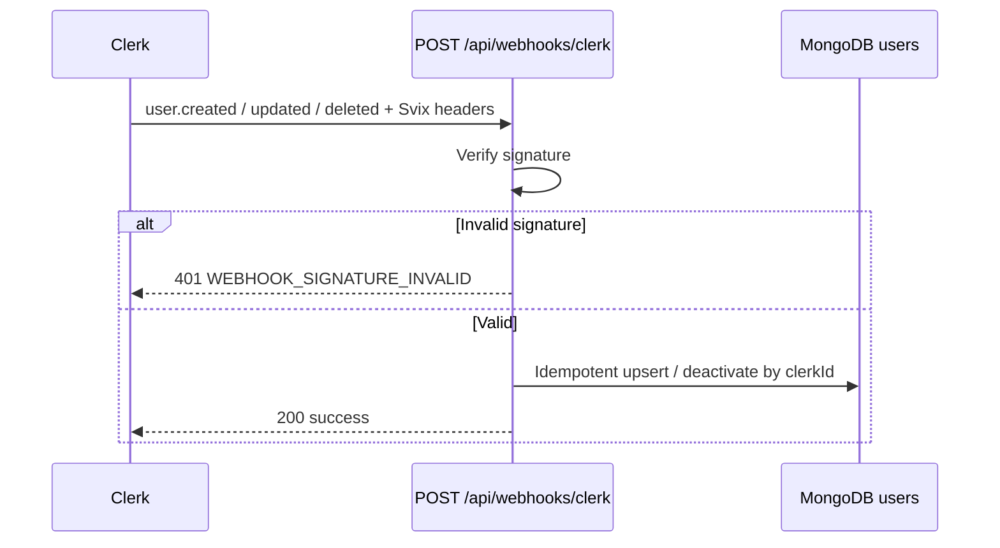
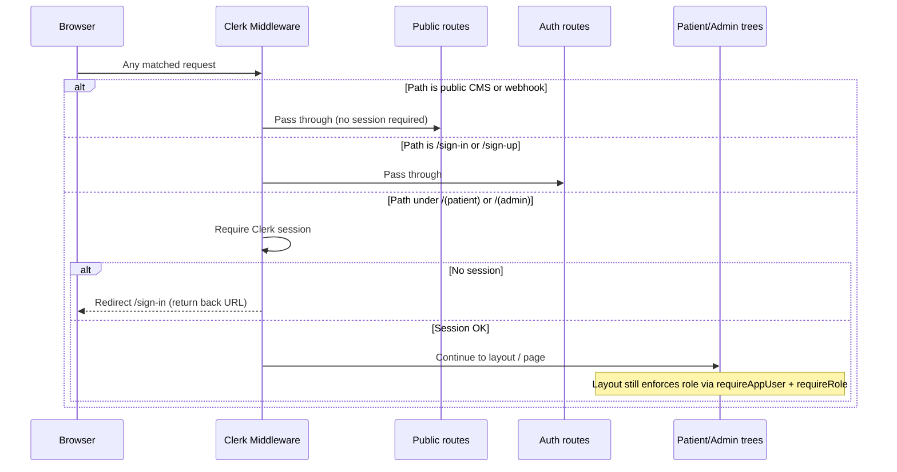

# 01 — Authentication API

**Project:** Krati Dental Care — Dental Clinic Management System  
**Status:** Designed (Phase 6 — documentation)  
**Related:** [00-api-guidelines.md](./00-api-guidelines.md) · [../03-system-architecture.md](../03-system-architecture.md) · [../04-database-design.md](../04-database-design.md)

---

## 1. Purpose

This document defines how **our application** authenticates users, resolves clinic roles, synchronizes identity with MongoDB, and protects Server Actions and routes.

**Clerk is the identity provider.** We do **not** redesign Clerk’s product surface (password UI, MFA enrollment, hosted pages). We document:

- Session validation at the Next.js edge and server
- Bootstrap and sync of the MongoDB `users` profile
- RBAC + ownership gates for patient and admin surfaces
- The Clerk webhook contract our Route Handler must honor
- Auth-adjacent operations (`getCurrentUser` / session bootstrap)

Passwords and session tokens are never stored in MongoDB. Clinic authorization truth lives on `users.role` (and linked `patientId` / `doctorId`).

---

## 2. Authentication Flow

### 2.1 Responsibilities split

| Concern | Owner |
|---------|--------|
| Sign-up, sign-in, session cookies/JWTs, MFA options | **Clerk** |
| App profile (`users`), role, `isActive`, domain links | **MongoDB** |
| Route protection, Server Action authz, ownership | **Next.js app** |
| Email/profile eventual sync from Clerk | **Webhook** → `users` |

### 2.2 End-to-end overview



### 2.3 Trust rules

1. A valid Clerk session alone is **not** sufficient for privileged clinic operations — an active Mongo `users` row is required.
2. Clients never send `role` or elevate privileges via request body.
3. Public CMS reads may omit auth; **all writes** require auth + authz.

---

## 3. User Registration Flow

Registration UI and credential handling are **Clerk-owned**. The app’s job is post-identity bootstrap.

### 3.1 Patient self-registration (default)



**Business rules**

| Rule | Detail |
|------|--------|
| Default role | New self-registered users → `patient` only |
| No self-elevate | Public flows must never set `admin` or `doctor` |
| Bootstrap timing | Lazy on first authenticated server touch **and/or** webhook `user.created` (idempotent upsert) |
| Patient link | Patient-role users get a `patients` document; `users.patientId` set |
| Identity fields | Sync `email` (and display name if used) from Clerk; no clinic PHI on `users` |

### 3.2 Admin / staff provisioning

| Method | When |
|--------|------|
| Secure seed script / env-gated bootstrap | First clinic admin |
| Admin-created invite → Clerk user → webhook/sync with `role=admin` | Subsequent admins |
| Clerk `publicMetadata.role` (optional mirror) | Edge hints only; **Mongo remains authoritative** |

**Forbidden:** Open sign-up that assigns `admin`.

---

## 4. Sign In Flow

Sign-in UX is Clerk-owned (`/(auth)/sign-in`). After Clerk establishes a session:



**Post-login routing (logical)**

| `users.role` | Landing surface |
|--------------|-----------------|
| `patient` | `/(patient)/…` |
| `admin` | `/(admin)/…` |
| `doctor` | Doctor portal when enabled; else admin clinical ops |

---

## 5. Session Validation

Every privileged Server Action and protected Route Handler (except verified webhooks) must:

1. Resolve Clerk session via official server helpers (`auth()` / equivalent).
2. Extract `clerkUserId`.
3. Load Mongo `users` where `clerkId` matches, `isActive === true`, and `deletedAt` is null.
4. Fail closed:

| Failure | Semantic | `error.code` |
|---------|----------|--------------|
| No / invalid Clerk session | Unauthorized | `UNAUTHORIZED` |
| Session OK, no app user after bootstrap failure | Unauthorized | `UNAUTHORIZED` or `USER_NOT_SYNCED` |
| App user inactive / deleted | Forbidden | `FORBIDDEN` / `ACCOUNT_DISABLED` |

**Webhook exception:** Clerk → `POST /api/webhooks/clerk` uses **Svix signature verification**, not a user session.

### 5.1 Operation — Get current app user (session bootstrap)

Documented as the canonical auth-adjacent read (Server Action or RSC helper). Maps logically to `GET /auth/me`.

#### Purpose

Return the authenticated clinic user context for UI shells and client bootstrap.

#### Authentication

Required (Clerk session).

#### Authorization

Any active app role (`patient`, `admin`, `doctor`). No elevated role required.

#### Request

| Field | Value |
|-------|--------|
| Surface | Server Action `getCurrentUser` (or RSC equivalent) |
| HTTP equivalent | `GET /auth/me` |
| Body | None |

#### Validation

No client body. Session + `clerkId` resolution only.

#### Business rules

- If session exists and Mongo user missing → attempt idempotent bootstrap (patient default) **or** return `USER_NOT_SYNCED` if webhook-only sync is enforced — **recommend:** lazy bootstrap for patients.
- Never return another user’s record.
- Do not expose secrets or Clerk private metadata dumps.

#### Response

```json
{
  "success": true,
  "data": {
    "id": "665f1c2a9a1b2c3d4e5f6789",
    "clerkId": "user_2abc…",
    "email": "patient@example.com",
    "role": "patient",
    "isActive": true,
    "patientId": "665f1c2a9a1b2c3d4e5f6790",
    "doctorId": null
  },
  "meta": {
    "requestId": "req_01JEXAMPLE"
  }
}
```

#### Errors

| `error.code` | When |
|--------------|------|
| `UNAUTHORIZED` | No valid session |
| `ACCOUNT_DISABLED` | `isActive` false or soft-deleted |
| `USER_NOT_SYNCED` | Session OK but app user cannot be resolved/created |
| `INTERNAL_ERROR` | Unexpected failure |

#### Status codes

`200`, `401`, `403`, `500`

#### Related collections

`users`, optionally `patients` / `doctors` (ids only)

---

## 6. Protected Routes

Route groups enforce **where** identity is required. Server Actions still re-check authz (defense in depth).

### 6.1 Public routes (no authentication)

| Area | Examples | Notes |
|------|----------|--------|
| Marketing / CMS reads | `/`, `/about`, published services/FAQs/testimonials | Read-only published content |
| Auth entry | `/sign-in`, `/sign-up` (Clerk catch-alls) | Unauthenticated by definition |
| Clerk webhook | `POST /api/webhooks/clerk` | Public URL; **signature-verified**, not session-auth |

Public routes must **not** expose admin mutations or patient PHI.

### 6.2 Authenticated routes (any signed-in active app user)

| Area | Examples |
|------|----------|
| Shared account shell | Session-aware nav that only needs `getCurrentUser` |
| Post-login redirect hub | Lightweight “choose destination” if used |

Most product surfaces are **role-specific** (below), not merely “logged in.”

### 6.3 Patient routes (`role === patient`)

| Area | Examples | Ownership |
|------|----------|-----------|
| Patient portal | `/(patient)/appointments`, prescriptions, limited profile | Own `patientId` only |
| Booking mutations | Book/cancel own appointments | Self; admin may act elsewhere on behalf |

Patients must not access `/(admin)/**`.

### 6.4 Admin routes (`role === admin`)

| Area | Examples |
|------|----------|
| Admin console | `/(admin)/doctors`, patients, slots, appointments, prescriptions, content/settings |

Admin may act on behalf of patients where product rules allow. Still subject to validation and domain invariants.

### 6.5 Doctor routes (`role === doctor`, optional v1)

When enabled: own schedule / clinical actions. Until then, admin covers clinical ops. Doctor must not gain admin CMS powers by default.

### 6.6 Access matrix (summary)

| Route class | Anonymous | Patient | Admin | Doctor (later) |
|-------------|-----------|---------|-------|----------------|
| Public site reads | ✓ | ✓ | ✓ | ✓ |
| Sign-in / sign-up | ✓ | ✓ | ✓ | ✓ |
| `/(patient)/**` | ✗ | ✓ | ✗* | ✗ |
| `/(admin)/**` | ✗ | ✗ | ✓ | ✗ |
| Clerk webhook | ✓ (signed) | — | — | — |
| Sensitive Server Actions | ✗ | Own data | Clinic-wide | Scoped |

\*Admin uses admin UI/actions for patient data, not the patient route group (unless product adds an explicit “view as” later).

---

## 7. User Synchronization Flow

Identity changes in Clerk must eventually match Mongo `users` without storing passwords.

### 7.1 Bootstrap paths

| Path | Trigger | Behavior |
|------|---------|----------|
| Lazy sync | First `requireAppUser()` / `getCurrentUser` | Upsert by `clerkId`; default `patient` |
| Webhook sync | Clerk `user.created` / `user.updated` / `user.deleted` | Upsert or deactivate; keep email/status consistent |

Both paths must be **idempotent** on `clerkId` (unique index).

### 7.2 Webhook — Clerk user lifecycle

#### Purpose

Keep Mongo `users` aligned with Clerk identity lifecycle.

#### Authentication

Not session-based. Verify **Svix** signature with Clerk webhook secret.

#### Authorization

N/A (machine-to-machine). Reject invalid signatures → `401`/`400`.

#### Request

| Field | Value |
|-------|--------|
| Method / path | `POST /api/webhooks/clerk` |
| Headers | Svix signature headers per Clerk |
| Body | Clerk event payload |

Handled events (v1):

| Event | App behavior |
|-------|----------------|
| `user.created` | Upsert `users`; role=`patient` unless provisioning rules set admin/doctor |
| `user.updated` | Update email / profile fields; do **not** blindly overwrite Mongo role from untrusted sources |
| `user.deleted` | Soft-disable: `isActive=false` and/or `deletedAt`; do not cascade-delete clinical history |

#### Validation

- Signature valid
- Event type allowlisted
- Stable `clerkId` present

#### Business rules

- **Role authority:** Mongo `users.role` wins for authorization. Optional Clerk `publicMetadata.role` may be updated by **trusted provisioning only**, never by end users.
- Webhook must not create admin users from public sign-up events.
- Clinical collections (`appointments`, `prescriptions`) are not deleted on Clerk delete.

#### Response

```json
{
  "success": true,
  "data": {
    "received": true
  },
  "meta": {
    "requestId": "req_01JEXAMPLE"
  }
}
```

Clerk expects a successful HTTP acknowledgment; keep body minimal.

#### Errors

| `error.code` | When |
|--------------|------|
| `UNAUTHORIZED` / `WEBHOOK_SIGNATURE_INVALID` | Bad Svix signature |
| `VALIDATION_ERROR` | Malformed event |
| `INTERNAL_ERROR` | Persist failure (log + retry via Clerk) |

#### Status codes

`200` (processed), `400`, `401`, `500`

#### Related collections

`users` (+ optional `patients` create on first patient sync)

### 7.3 Sequence — webhook sync



---

## 8. Role Resolution

### 8.1 Source of truth

| Data | Source |
|------|--------|
| Identity (`clerkId`, session) | Clerk |
| **Role** (`admin` \| `doctor` \| `patient`) | MongoDB `users.role` |
| Domain links | `users.patientId`, `users.doctorId` |
| Optional edge mirror | Clerk `publicMetadata.role` (non-authoritative) |

Reserved future roles (`receptionist`, `assistant`) exist in the database contract but are **not** granted in v1 product gates.

### 8.2 Resolution algorithm (conceptual)

```
clerkUserId ← auth()
if !clerkUserId → UNAUTHORIZED

appUser ← users.find({ clerkId, isActive, deletedAt: null })
if !appUser → bootstrap patient OR USER_NOT_SYNCED
if !appUser.isActive → ACCOUNT_DISABLED

context ← {
  userId: appUser._id,
  role: appUser.role,
  patientId: appUser.patientId,
  doctorId: appUser.doctorId
}
```

### 8.3 Defaults

| Event | Resolved role |
|-------|----------------|
| Public self sign-up | `patient` |
| Admin provisioned staff | Explicit `admin` or `doctor` at provision time |
| Missing role field | Treat as forbidden / repair needed — never guess `admin` |

---

## 9. Authorization Strategy

Aligned with API guidelines §2 and system architecture §7.

### 9.1 Model

**RBAC + ownership** (not ABAC in v1).

| Layer | Responsibility |
|-------|----------------|
| Middleware | Signed-in for portal/admin trees |
| Layout role gate | `(patient)` / `(admin)` role match |
| Server Action / Route Handler | Role + ownership before mutation/read |
| Service | Invariants (e.g. booking `patientId` matches caller unless admin) |
| Query filters | Patient lists always scoped by `patientId` |

**Never** rely on hiding UI alone.

### 9.2 Capability overview (auth-relevant)

| Capability | Patient | Admin | Doctor (later) |
|------------|---------|-------|----------------|
| Access own portal | ✓ | — | — |
| Book/cancel own appointment | ✓ | ✓ (on behalf) | — |
| Confirm appointments / manage slots | ✗ | ✓ | Scoped |
| Manage doctors / CMS / settings | ✗ | ✓ | ✗ |
| Issue / void prescriptions | ✗ | ✓ | ✓ (when enabled) |
| Download own Rx PDF | ✓ (status allowlist) | ✓ | — |

### 9.3 Ownership rules

| Resource access | Allowed if |
|-----------------|------------|
| Patient-scoped read/mutate | `role=patient` and `patientId` matches **or** `role=admin` |
| Cross-patient read by patient | Deny → prefer `404` (`NOT_FOUND`) to reduce PHI probing |
| Role elevation | Never from client input |

### 9.4 Deny by default

If an operation is not explicitly allowed for the resolved role (and ownership), return `FORBIDDEN` (or `NOT_FOUND` for cross-patient reads).

---

## 10. Middleware Flow

Clerk middleware runs on matching App Router paths before layouts and actions.



### 10.1 Middleware responsibilities

| Do | Do not |
|----|--------|
| Enforce “must be signed in” on portal/admin matchers | Perform full business authz / ownership |
| Redirect unauthenticated users to sign-in | Trust `publicMetadata.role` alone for mutations |
| Allow public + webhook paths | Block Clerk webhook with session checks |

### 10.2 Layout responsibilities (after middleware)

| Layout | Check |
|--------|-------|
| `/(patient)/layout` | `requireAppUser()` + `role === patient` |
| `/(admin)/layout` | `requireAppUser()` + `role === admin` |

Wrong role → `403` page or safe redirect (never silent elevation).

---

## 11. Authentication Helpers

Conceptual helper catalog (implementation lives under `lib/auth*` / shared actions). Server Actions and sensitive Route Handlers **must** use these instead of ad-hoc Clerk checks.

| Helper | Returns / effect | Failure |
|--------|------------------|---------|
| `requireAuth()` | Clerk `userId` (session present) | `UNAUTHORIZED` |
| `requireAppUser()` | Mongo user + role + links; ensures active | `UNAUTHORIZED` / `ACCOUNT_DISABLED` / `USER_NOT_SYNCED` |
| `requireRole(role \| roles[])` | App user asserted to role set | `FORBIDDEN` |
| `requirePatientAccess(patientId)` | Caller is owning patient **or** admin | `FORBIDDEN` or `NOT_FOUND` |
| `getCurrentUser()` | Soft read of context for UI (may return null vs throw — pick one project rule; **recommend:** throw/`ActionResult` error on protected surfaces, nullable only on optional UI) | Same codes as above |

### 11.1 Usage order in Server Actions

```
1. requireAppUser()
2. requireRole(...) / requirePatientAccess(...)
3. Zod safeParse
4. service method
5. revalidatePath / revalidateTag
6. ActionResult success | error
```

### 11.2 Mapping to HTTP / ActionResult

Helpers map to the standard envelope in [00-api-guidelines.md](./00-api-guidelines.md) §4.4–4.5 (`UNAUTHORIZED`, `FORBIDDEN`) even when the Server Action transport returns HTTP 200 with `success: false`.

---

## 12. Error Responses

Auth responses follow the global envelope. Auth-specific codes:

| `error.code` | HTTP | Meaning |
|--------------|------|---------|
| `UNAUTHORIZED` | 401 | Missing/invalid Clerk session |
| `FORBIDDEN` | 403 | Authenticated but role/ownership insufficient |
| `ACCOUNT_DISABLED` | 403 | Mongo user inactive or soft-deleted |
| `USER_NOT_SYNCED` | 401/403 | Session valid; app user missing/unusable |
| `WEBHOOK_SIGNATURE_INVALID` | 401 | Clerk webhook signature failed |
| `VALIDATION_ERROR` | 400 | Malformed webhook/auth bootstrap input |
| `RATE_LIMITED` | 429 | Auth-adjacent / abuse protection |
| `INTERNAL_ERROR` | 500 | Unexpected failure |

### 12.1 Unauthorized example

```json
{
  "success": false,
  "error": {
    "code": "UNAUTHORIZED",
    "message": "Authentication required"
  },
  "meta": {
    "requestId": "req_01JEXAMPLE"
  }
}
```

### 12.2 Forbidden example

```json
{
  "success": false,
  "error": {
    "code": "FORBIDDEN",
    "message": "You do not have permission to perform this action"
  },
  "meta": {
    "requestId": "req_01JEXAMPLE"
  }
}
```

### 12.3 Account disabled example

```json
{
  "success": false,
  "error": {
    "code": "ACCOUNT_DISABLED",
    "message": "This account is disabled. Contact the clinic for help."
  },
  "meta": {
    "requestId": "req_01JEXAMPLE"
  }
}
```

### 12.4 UI treatment

| Code | Client treatment |
|------|------------------|
| `UNAUTHORIZED` | Redirect to `/sign-in` |
| `FORBIDDEN` / `ACCOUNT_DISABLED` | 403 page or inline error; do not retry as another role |
| `USER_NOT_SYNCED` | Retry once / show “account setup” + log for webhook lag |
| `WEBHOOK_SIGNATURE_INVALID` | Server log only; no user UI |

---

## 13. Security Considerations

| Control | Requirement |
|---------|-------------|
| Password storage | None in app/Mongo — Clerk only |
| Session validation | Every privileged action; fail closed |
| Inactive users | Reject even with valid Clerk session |
| Role authority | Mongo `users.role`; never accept client-supplied role |
| Admin provisioning | Out-of-band; no public self-elevate |
| Webhooks | Svix verification mandatory |
| Secrets | `CLERK_SECRET_KEY`, webhook secret, `MONGODB_URI` server-only; publishable key may be `NEXT_PUBLIC_*` |
| PHI | Do not put medical data on `users`; scope patient APIs by ownership |
| CSRF | Prefer Clerk SameSite session + Server Actions; no state-changing GETs |
| Rate limiting | Auth-adjacent and booking paths → `429` / `RATE_LIMITED` |
| Logging | Log `requestId`, actor Mongo id, auth error codes; avoid raw PII/webhook bodies at info |
| Probing | Cross-patient access → prefer `404 NOT_FOUND` |

---

## 14. Future Improvements

| Item | Notes |
|------|-------|
| Clerk Organizations ↔ multi-clinic | Map org membership to `clinicId` + per-clinic roles |
| Additional roles | `receptionist`, `assistant` gates without schema rewrite |
| Doctor portal | First-class `/(doctor)` group + scoped slot/Rx authz |
| Stronger webhook-only bootstrap | Disable lazy create; require verified webhook before access |
| Step-up / MFA policies | Enforce via Clerk for admin role |
| External mobile APIs | `/api/v1/...` bearer/session; reuse helpers + services |
| `audit_logs` | Record authz denials, admin role changes, account disables |
| Idempotency for provisioning | Explicit admin invite tokens |
| Rate-limit at edge | Per-IP sign-in adjacent + per-user action limits |

---

## Documentation checklist (guidelines §11)

| Concern | Covered |
|---------|---------|
| Purpose | §1 |
| Authentication / session | §2, §5 |
| Authorization / roles | §6, §8, §9 |
| Registration / sign-in / sync | §3, §4, §7 |
| Middleware / helpers | §10, §11 |
| Errors / security / roadmap | §12–§14 |
| Endpoint-style contracts | §5.1 `getCurrentUser`, §7.2 webhook |
| Related collections | `users`, `patients`, `doctors` (links only) |

---

*End of Authentication API design. No application code in this document.*
