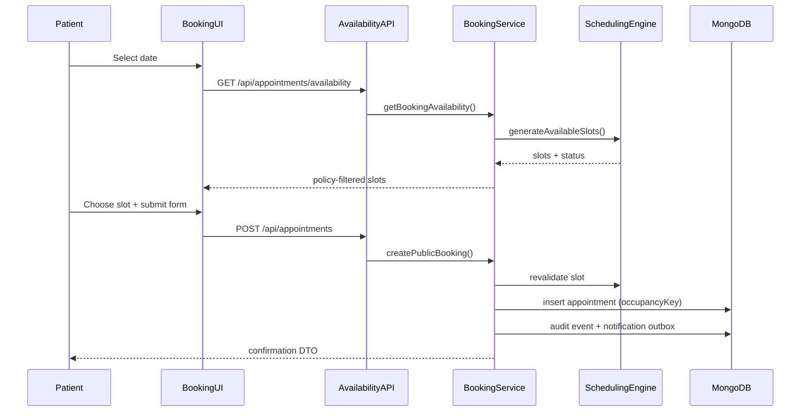

# Appointment Booking Architecture

## Overview

Phase 15 implements public guest booking and admin appointment lifecycle management on top of the existing **Dynamic Scheduling Engine**. Appointments store canonical UTC `startsAt` / `endsAt` instants with `slotId: null`. Slot inventory is never persisted.

## Booking flow



### Steps

1. **Date selection** — patient picks a civil date (`YYYY-MM-DD`).
2. **Availability** — `getBookingAvailability()` resolves the clinic `defaultDoctorId`, calls `generateAvailableSlots()`, then applies booking policy (`minLeadTimeHours`, `maxAdvanceDays`, `allowSameDayBooking`).
3. **Slot display** — only slots with `status === "available"` after policy filtering are shown.
4. **Submission** — client sends canonical `startAt` / `endAt` ISO instants plus patient details and optional `bookingReference` idempotency key.
5. **Server revalidation** — `assertSlotAvailableForBooking()` reruns availability immediately before write.
6. **Atomic claim** — `occupancyKey = {doctorId}:{startMinuteEpoch}` unique index prevents concurrent double booking.
7. **Persistence** — `PENDING` appointment with patient/doctor snapshots; patient resolved or created by phone.
8. **Side effects** — append-only `appointment_events` row and pending `notification_outbox` intents.

## Appointment lifecycle

| Status | Admin actions |
|--------|----------------|
| `PENDING` | Approve → `CONFIRMED`, Cancel, Reschedule |
| `CONFIRMED` | Complete → `COMPLETED`, Cancel, Reschedule |
| `COMPLETED` | Terminal |
| `CANCELLED` | Terminal (occupancy released) |
| `NO_SHOW` | Future-ready (no admin UI action yet) |

Transitions are enforced in `features/appointments/lib/lifecycle.ts` and applied in `lifecycle-actions.ts`.

## Folder structure

```text
features/appointments/
  actions/index.ts           # Admin Server Actions
  components/                # Booking + dashboard UI
  lib/
    booking-policy.ts        # ClinicSettings policy (pure)
    lifecycle.ts             # Status transitions (pure)
    occupancy.ts             # Occupancy keys + slot matching
    format.ts                # Display helpers
  services/
    booking-availability.ts  # Public availability adapter
    create-booking.ts        # Public booking + idempotency
    default-doctor.ts        # defaultDoctorId resolution
    lifecycle-actions.ts     # Approve / cancel / complete / reschedule
    list-appointments.ts     # Admin list + detail
    notification-events.ts   # Audit + outbox enqueue
    patient-resolution.ts    # Find/create patient by phone
  types.ts
  index.ts

models/
  appointment/               # Extended schema (occupancy, booking source)
  appointment-event/         # Append-only audit trail
  notification-outbox/       # Provider-neutral notification intents

app/
  (public)/book-appointment/page.tsx
  (dashboard)/dashboard/appointments/page.tsx
  api/appointments/          # Public availability + booking
  api/dashboard/appointments/ # Admin list, detail, actions
```

## API design

### Public

| Method | Path | Description |
|--------|------|-------------|
| `GET` | `/api/appointments/availability?date=` | Policy-aware slots for default doctor |
| `POST` | `/api/appointments` | Create public booking (idempotent) |

### Admin (permission-guarded)

| Method | Path | Permission |
|--------|------|------------|
| `GET` | `/api/dashboard/appointments` | `appointments:read_all` |
| `GET` | `/api/dashboard/appointments/[id]` | `appointments:read_all` |
| `PATCH` | `/api/dashboard/appointments/[id]` | `appointments:manage` |

`PATCH` body uses a discriminated union: `{ action: "approve" }`, `{ action: "cancel", cancellationReason }`, `{ action: "complete" }`, `{ action: "reschedule", date, startAt, endAt }`.

## Scheduling engine consumption

- **Availability** — `generateAvailableSlots(date, { doctorId, durationMinutes, excludeAppointmentId })` loads clinic settings, holidays, overrides, and blocking appointments, then runs the pure `generateSlotsForDate` engine.
- **Booking policy** — applied after engine output in `getBookingAvailability()` (lead time, advance window, same-day rules).
- **Rescheduling** — passes `excludeAppointmentId` so the appointment does not block its own current window.
- **Write path** — always revalidates against live engine output; never trusts client labels or durations.

## Concurrency strategy

1. Revalidate slot against engine output.
2. Insert with unique sparse `occupancyKey` for blocking statuses.
3. Translate MongoDB `E11000` duplicate key to `409 Conflict`.
4. Support idempotent retries via unique sparse `bookingReference`.

## Future notification integration

`notification_outbox` stores pending intents per channel (`EMAIL`, `WHATSAPP`, `REMINDER`) with stable `idempotencyKey`. A future worker can:

1. Poll `status: PENDING` rows.
2. Dispatch to email/WhatsApp providers.
3. Mark `SENT` or `FAILED` with `lastError`.

No provider SDKs are wired in Phase 15 — only enqueue points after successful lifecycle writes.
